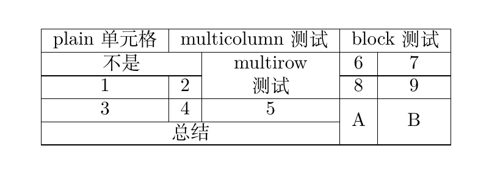
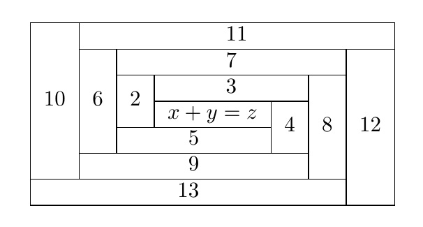

# Convert excel table to latex table

This tool convert excel table to latex table in human-readable format.

## Requirements

Please add the following required packages to your document preamble:

```tex
\usepackage{multirow, makecell}
```

Following python packages are needed:

```shell
pip install openpyxl
```

## Usage

```text
usage: excel2tex.py [-h] -s SOURCE -o TARGET

optional arguments:
  -h, --help  show this help message and exit
  -s SOURCE   source file (default: table.xlsx)
  -o TARGET   target file (default: table.tex)
  --sig [ENCODING]  set file encoding to utf-8-sig, only use when there is mess code.
  -m [MATH], --math [MATH] enable inline math
```

If you are using windows and have no python installed, an executable file is provided [here](https://github.com/ZhiyuanLck/excel2tex/releases/tag/0.1)

## Note

You should obey some rules of how to create a table that can be successfully converted:

- The height of every merged cell must be not less than the number of lines in your text.

## Example

### First

Here is a excel table


`main.tex`

```tex
\documentclass{article}
\usepackage{xeCJK}
\usepackage{multirow, makecell}

\begin{document}
\input{table.tex}
\end{document}
```

Generated `table.tex` by `python excel2tex.py -s table.xlsx -o table.tex`

```tex
% Please add the following required packages to your document preamble:
% \usepackage{multirow, makecell}
\begin{tabular}{*{5}{|c}|}
\hline
% row 1
  plain单元格
  & \multicolumn{2}{c|}{multicolumn测试}
  & \multicolumn{2}{c|}{block测试} \\
\hline
% row 2
  \multicolumn{2}{|c|}{不是}
  & \multirowcell{2}{multirow \\测试}
  & 6
  & 7 \\
\cline{1-2}
\cline{4-5}
% row 3
  1
  & 2
  &  & 8
  & 9 \\
\hline
% row 4
  3
  & 4
  & 5
  & \multirowcell{2}{A}
  & \multirowcell{2}{B} \\
\cline{1-3}
% row 5
  \multicolumn{3}{|c|}{总结}
  &  &  \\
\hline
\end{tabular}
```

Compile result: `main.pdf`



### Second

Excel table


Generated code in `table.tex` by `python excel2tex -s table.xlsx --math`

```tex
% Please add the following required packages to your document preamble:
% \usepackage{multirow, makecell}
\begin{tabular}{*{7}{|c}|}
\hline
% row 1
  \multirowcell{6}{10}
  & \multicolumn{6}{c|}{11} \\
\cline{2-7}
% row 2
  & \multirowcell{4}{6}
  & \multicolumn{4}{c|}{7}
  & \multirowcell{6}{12} \\
\cline{3-6}
% row 3
  &  & \multirowcell{2}{2}
  & \multicolumn{2}{c|}{3}
  & \multirowcell{4}{8}
  &  \\
\cline{4-5}
% row 4
  &  &  & $x + y = z$
  & \multirowcell{2}{4}
  &  &  \\
\cline{3-4}
% row 5
  &  & \multicolumn{2}{c|}{5}
  &  &  &  \\
\cline{2-5}
% row 6
  & \multicolumn{4}{c|}{9}
  &  &  \\
\cline{1-6}
% row 7
  \multicolumn{6}{|c|}{13}
  &  \\
\hline
\end{tabular}
```

Generated table



## Trouble shooting

### Mess code

Try to set encoding to `utf-8-sig`, for example

```shell
python excel2tex.py -s table.xlsx -o table.tex --sig
```

### Missing vertical line or redundant empty row

Please check the space of every merged cell whether they satisfy the conditions in **Note**.
